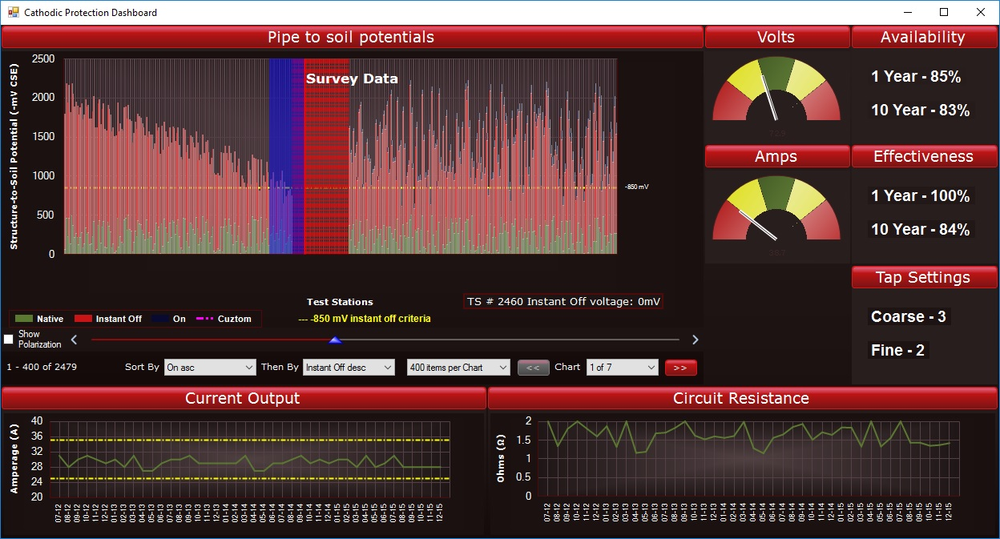

# ChartControl

A windows executable demo that interfaces easily with supplied data that displays interactive charts and graphs.

This executable is a demo, but the code has working libraries. Please use as you wish.

One third party control used here: gTrackBar control (the slider control with blue triangle below). Thank you to "SSDiver2112" at https://www.codeproject.com/Articles/35104/gTrackBar-A-Custom-TrackBar-UserControl-VB-NET

## Screen shot

### Prerequisites

Requires .NET framework 4.0

## Authors

* Alex Green - [aleckzandr](https://github.com/aleckzandr)
